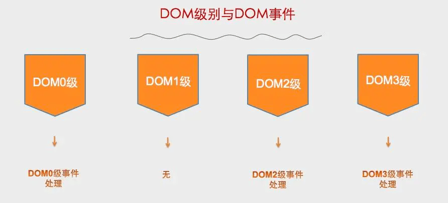
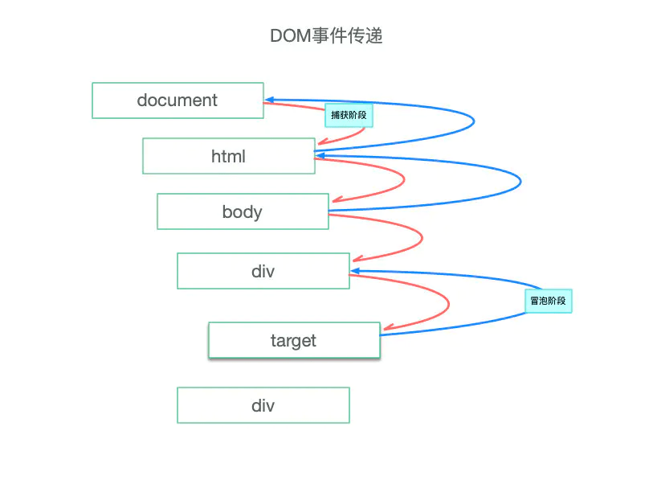

# DOM事件

## 事件级别
DOM级别一共可以分为4个级别：DOM0级，DOM1级，DOM2级和 DOM3级，而DOM事件分为3个级别：DOM0级事件处理，DOM2级事件处理和DOM3级事件处理。如下图所示：



有人可能会问，为什么没有DOM1级事件处理呢？因为1级DOM标准中并没有定义事件相关的内容，所以没有所谓的1级DOM事件模型。

- DOM0：element.onclick = function(){}
- DOM2：element.addEventListener('click', function(){}, false)
- DOM3：element.addEventListener('keyup', function(){}, false)

`addEventListener`: 第三个参数为指定事件是否在捕获阶段执行

设置为`true`表示事件在捕获阶段执行，而设置为`false`表示事件在冒泡阶段执行

## 事件流

事件流规定包含三个流程：
- 事件捕获阶段
- 处于目标阶段
- 事件冒泡阶段

首先发生是事件捕获（截获事件），然后是处于目标阶段接收到事件，最后是事件冒泡阶段（对事件作出相应）。




## 事件冒泡

所谓事件冒泡就是事件像泡泡一样从最开始生成的地方一层一层往上冒，直至最外层的html或document。

下面是代码示例：

```html
<div id="box">
    <div id="parent">
        <a id="child">事件冒泡</a>
    </div>
</div>
<script>
var box = document.getElementById('box'),
    parent = document.getElementById('parent'),
    child = document.getElementById('child');

child.addEventListener('click', function() {
    console.log('我是目标事件');
}, false);

parent.addEventListener('click', function() {
    console.log('我是父元素');
}, false);

box.addEventListener('click', function() {
    console.log('我是box');
}, false);

// 我是目标事件
// 我是父元素
// 我是box
</script>
```
上面的代码运行后我们点击a标签，首先会弹出'我是目标事件'提示，然后又会弹出'我是父元素''我是box'的提示，这便说明了事件自内而外向上冒泡了。


## 事件捕获

和事件冒泡相反，事件捕获是自上而下执行，我们只需要将`addEventListener`的第三个参数改为true就行。

```html
<div id="box">
    <div id="parent">
        <a id="child">事件冒泡</a>
    </div>
</div>
<script>
var box = document.getElementById('box'),
    parent = document.getElementById('parent'),
    child = document.getElementById('child');

child.addEventListener('click', function() {
    console.log('我是目标事件');
}, true);

parent.addEventListener('click', function() {
    console.log('我是父元素');
}, true);

box.addEventListener('click', function() {
    console.log('我是box');
}, true);

// 我是box
// 我是父元素
// 我是目标事件
</script>
```

此时我们点击a标签，首先弹出的是'我是box''我是父元素'，最后才是'我是目标事件'，正好与事件冒泡相反。

## 阻止事件

如果我们不想让事件冒泡，或者捕获，那么该怎么做呢，可以使用`Event对象`来阻止了

```js
// 阻止默认事件
event.preventDefault()
// 阻止事件冒泡捕获
event.stopPropagation()
```

event.stopImmediatePropagation()

阻止剩下的事件处理程序被执行。如果一个元素上绑定了三个事件，在其中一个事件上调用了这个方法，那其他 的两个事件将不会被执行。

```js
var go = document.getElementById('go');

function goFn(event) {
    event.preventDefault();
    event.stopImmediatePropagation(); // 阻止事件冒泡并阻止同类型事件
    
    console.log('我没有跳转！');
}

function goFn2(event) {
    console.log('我是同类型事件！');
}

go.addEventListener('click', goFn, false);
go.addEventListener('click', goFn2, false);
```

我们在a链接上继续加了一个点击事件，如果我们在`goFn`方法中添加了`stopImmediatePropagation`方法，那么`goFn2`方法将不会被执行，同时也不会将点击事件冒泡至上层。

## 事件委托

事件委托，通俗的说就是将元素的事件委托给它的父级或者更外级的元素处理，它的实现机制就是事件冒泡。

假设有一个列表，要求点击列表项弹出对应的字段：

```html
<ul id="myLink">
    <li id="1">aaa</li>
    <li id="2">bbb</li>
    <li id="3">ccc</li>
</ul>
```

不使用事件委托

```js
var myLink = document.getElementById('myLink');
var li = myLink.getElementsByTagName('li');

for(var i = 0; i < li.length; i++) {
    li[i].onclick = function(e) {
        var e = event || window.event;
        var target = e.target || e.srcElement;
        alert(e.target.id + ':' + e.target.innerText);  
    };
}
```
存在问题：
- 给每一个列表都绑定事件，消耗内存
- 当有动态添加的元素时，需要重新给元素绑定事件

使用事件委托

```js
myLink.addEventListener('click', function(e){
    if(e.target.closest('li').tagName.toLowerCase() == 'li'){
        fn() // 执行某个函数
    }
})
```


## 先冒泡后捕获

根据w3c标准，应先捕获再冒泡。

若要实现先冒泡后捕获，给一个元素绑定两个`addEventListener`，其中一个第三个参数设置为false（即冒泡），另一个第三个参数设置为true（即捕获），调整它们的代码顺序，将设置为false的监听事件放在设置为true的监听事件前面即可。
