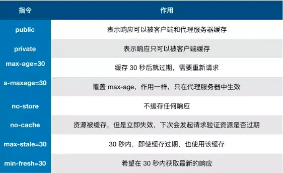

# 前端缓存

缓存是性能优化中非常重要的一环，浏览器的缓存机制对开发也是非常重要的知识点。接下来以三个部分来把浏览器的缓存机制说清楚：

- 强缓存
- 协商缓存
- 缓存位置

## 强缓存

浏览器中的缓存作用分为两种情况，一种是需要发送`HTTP`请求，一种是不需要发送。

首先是检查强缓存，这个阶段不需要发送`HTTP`请求。

### Expires

Expires即过期时间，存在于服务端返回的响应头中，告诉浏览器在这个过期时间之前可以直接从缓存里面获取数据，无需再次请求。比如下面这样:

```js
Expires: Wed, 22 Nov 2019 08:41:00 GMT
```

表示资源在`2019年11月22号8点41分`过期，过期了就得向服务端发请求。

这个方式看上去没什么问题，合情合理，但其实潜藏了一个坑，那就是**服务器的时间和浏览器的时间可能并不一致**，那服务器返回的这个过期时间可能就是不准确的。因此这种方式很快在后来的HTTP1.1版本中被抛弃了。

### Cache-Control

在HTTP/1.1中，Cache-Control是最重要的规则，主要用于控制网页缓存。

它和`Expires`本质的不同在于它并没有采用**具体的过期时间点**这个方式，而是采用过期时长来控制缓存，对应的字段是`max-age`。比如这个例子:

```js
Cache-Control: max-age=3600
```

代表这个响应返回后在 3600 秒，也就是一个小时之内可以直接使用缓存。

Cache-Control可以在请求头或者响应头中设置，并且可以组合使用多种指令：



### 总结

其实这两者差别不大，区别就在于 Expires 是http1.0的产物，Cache-Control是http1.1的产物。

两者同时存在的话，**Cache-Control优先级高于Expires**；在某些不支持HTTP1.1的环境下，Expires就会发挥用处。所以Expires其实是过时的产物，现阶段它的存在只是一种兼容性的写法。

当然，还存在一种情况，当资源缓存时间超时了，也就是强缓存失效了，接下来怎么办？没错，这样就进入到第二级屏障——**协商缓存**了。


## 协商缓存

协商缓存就是强制缓存失效后，浏览器携带缓存标识向服务器发起请求，由服务器根据缓存标识决定是否使用缓存的过程，主要有以下两种情况：

- 协商缓存生效，返回304和Not Modified
- 协商缓存失效，返回200和请求结果

协商缓存可以通过设置两种 HTTP Header 实现：Last-Modified 和 ETag 。

### Last-Modified

即最后修改时间。在浏览器第一次给服务器发送请求后，服务器会在响应头中加上这个字段。

```js
Last-Modified: Fri, 22 Jul 2016 01:47:00 GMT
```

浏览器接收到后，如果再次请求，会在请求头中携带`If-Modified-Since`字段，这个字段的值也就是服务器传来的最后修改时间。

服务器拿到请求头中的`If-Modified-Since`的字段后，会跟服务器中该资源的最后修改时间进行对比:

- 如果请求头中的这个值小于最后修改时间，说明是时候更新了。返回新的资源和200，跟常规的HTTP请求响应的流程一样。
- 否则返回304，告诉浏览器直接从缓存读取。


### ETag

**Etag 是服务器响应请求时，返回当前资源文件的一个唯一标识(由服务器生成)，只要资源有变化，Etag就会重新生成。**

浏览器接收到`ETag`的值，会在下次请求时，将这个值作为`If-None-Match`这个字段的内容，并放到请求头中，然后发给服务器。

服务器接收到`If-None-Match`后，会跟服务器上该资源的`ETag`进行比对:

- 如果两者不一样，说明要更新了。返回新的资源和200，跟常规的HTTP请求响应的流程一样。
- 否则返回304，告诉浏览器直接用缓存。

### 两者对比

1. 在精准度上，`ETag`优于`Last-Modified`。

由于`ETag`是按照内容给资源上标识，因此能准确感知资源的变化。而`Last-Modified`就不一样了，它在一些特殊的情况并不能准确感知资源变化，主要有两种情况:

- 编辑了资源文件，但是文件内容并没有更改，这样也会造成缓存失效。
- `Last-Modified`能够感知的单位时间是秒，如果文件在 1 秒内改变了多次，那么这时候的`Last-Modified`并没有体现出修改了。

2. 在性能上，`Last-Modified`优于`ETag`，也很简单理解，`Last-Modified`仅仅只是记录一个时间点，而`Etag`需要根据文件的具体内容生成哈希值。

3. 在优先级上，服务器校验优先考虑`Etag`


## 缓存机制

强制缓存优先于协商缓存进行，若强制缓存`(Expires和Cache-Control)`生效则直接使用缓存，若不生效则进行协商缓存`(Last-Modified / If-Modified-Since和Etag / If-None-Match)`。

协商缓存由服务器决定是否使用缓存，

若协商缓存失效，那么代表该请求的缓存失效，返回200，重新返回资源和缓存标识，再存入浏览器缓存中；

生效则返回304，继续使用缓存。

## 缓存位置

前面我们已经提到，当强缓存命中或者协商缓存中服务器返回304的时候，我们直接从缓存中获取资源。那这些资源究竟缓存在什么位置呢？

浏览器中的缓存位置一共有四种，按优先级从高到低排列分别是：

- Service Worker
- Memory Cache（内存缓存）
- Disk Cache（硬盘缓存）
- Push Cache（推送缓存）

### Service Worker
和Web Worker类似，是独立的线程，我们可以在这个线程中缓存文件，在主线程需要的时候读取这里的文件，Service Worker使我们可以自由选择缓存哪些文件以及文件的匹配、读取规则，并且缓存是持续性的

### Memory Cache 和 Disk Cache

Memory Cache指的是内存缓存，从效率上讲它是最快的。但是从存活时间来讲又是最短的，当渲染进程结束后，内存缓存也就不存在了。

Disk Cache就是存储在磁盘中的缓存，从存取效率上讲是比内存缓存慢的，但是他的优势在于存储容量和存储时长。稍微有些计算机基础的应该很好理解，就不展开了。

好，现在问题来了，既然两者各有优劣，那浏览器如何决定将资源放进内存还是硬盘呢？主要策略如下：

- 比较大的JS、CSS文件会直接被丢进磁盘，反之丢进内存
- 内存使用率比较高的时候，文件优先进入磁盘


### Push Cache

即推送缓存，这是浏览器缓存的最后一道防线。是HTTP/2的内容，目前应用较少


## 总结

对浏览器的缓存机制来做个简要的总结:

首先通过`Cache-Control`验证强缓存是否可用

- 如果强缓存可用，直接使用
- 否则进入协商缓存，即发送`HTTP`请求，服务器通过请求头中的`If-Modified-Since`或者`If-None-Match`这些条件请求字段检查资源是否更新
    - 若资源更新，返回资源和200状态码
    - 否则，返回304，告诉浏览器直接从缓存获取资源


<br>

[深入理解浏览器的缓存机制](https://www.jianshu.com/p/54cc04190252?_blank)