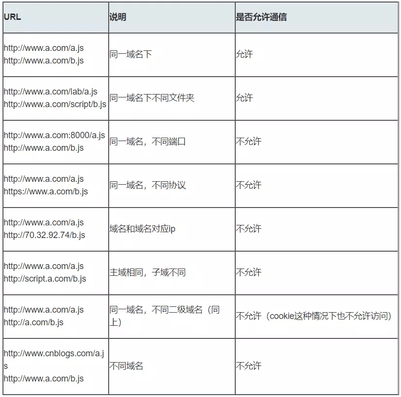

# 跨域

前后端数据交互经常会碰到请求跨域，什么是跨域，以及有哪几种跨域方式，这是本文要探讨的内容。

> 小提示： 如果平常自身有使用场景可结合使用场景进行讲解，比如我在这里使用过的场景是`CORS`和`Nginx`反向代理。


## 同源政策

同源策略是一种约定，它是浏览器最核心也最基本的安全功能，如果缺少了同源策略，浏览器很容易受到XSS、CSRF等攻击。所谓同源是指"协议+域名+端口"三者相同，即便两个不同的域名指向同一个ip地址，也非同源。


同源策略限制内容有：

- Cookie、LocalStorage、IndexedDB 等存储性内容
- DOM 节点
- AJAX 请求发送后，结果被浏览器拦截了

但是有三个标签是允许跨域加载资源：

- ``
- `<link href=XXX>`
- `<script src=XXX>`

当协议、子域名、主域名、端口号中任意一个不相同时，都算作不同域。不同域之间相互请求资源，就算作“跨域”。常见跨域场景如下图所示：




## CORS

CORS需要浏览器和后端同时支持。IE 8 和 9 需要通过`XDomainRequest`来实现。

浏览器会自动进行`CORS`通信，实现`CORS`通信的关键是后端。只要后端实现了`CORS`，就实现了跨域。

服务端设置`Access-Control-Allow-Origin`就可以开启`CORS`。 该属性表示哪些域名可以访问资源，如果设置通配符则表示所有网站都可以访问资源。

虽然设置`CORS`和前端没什么关系，但是通过这种方式解决跨域问题的话，会在发送请求时出现两种情况，分别为简单请求和复杂请求。

Nodejs设置cors实现，其他语言类似，添加请求头即可
```js
// 设置所有接口可跨域访问
app.all('*', function(req, res, next) {
    res.header("Access-Control-Allow-Origin", "*");
    res.header("Access-Control-Allow-Headers", "X-Requested-With");
    res.header("Access-Control-Allow-Methods","PUT,POST,GET,DELETE,OPTIONS");
    res.header("X-Powered-By",' 3.2.1')
    res.header("Content-Type", "application/json;charset=utf-8");
    next();
})
```

### 简单请求

只要同时满足以下两大条件，就属于简单请求

- 请求方法是以下三种方法之一：
    - HEAD
    - GET
    - POST
- HTTP的头信息不超出以下几种字段：
    - Accept
    - Accept-Language
    - Content-Language
    - Last-Event-ID
    - Content-Type：只限于三个值(application/x-www-form-urlencoded、multipart/form-data、text/plain)

### 非简单请求

非简单请求是那种对服务器有特殊要求的请求，比如请求方法是`PUT`或`DELETE`，或者`Content-Type`字段的类型是`application/json`。

非简单请求的`CORS`请求，会在正式通信之前，增加一次`HTTP`查询请求，称为"预检"请求,该请求是`option`方法的，通过该请求来知道服务端是否允许跨域请求。


服务器端对于CORS的支持，主要就是通过设置Access-Control-Allow-Origin来进行的。如果浏览器检测到相应的设置，就可以允许Ajax进行跨域的访问。

- [跨域资源共享 CORS 详解](http://www.ruanyifeng.com/blog/2016/04/cors.html?_blank)


## postMessage

postMessage是HTML5 XMLHttpRequest Level 2中的API，且是为数不多可以跨域操作的window属性之一，它可用于解决以下方面的问题：

- 页面和其打开的新窗口的数据传递
- 多窗口之间消息传递
- 页面与嵌套的iframe消息传递
- 上面三个场景的跨域数据传递

postMessage()方法允许来自不同源的脚本采用异步方式进行有限的通信，可以实现跨文本档、多窗口、跨域消息传递。

> otherWindow.postMessage(message, targetOrigin, [transfer]);

- message: 将要发送到其他 window的数据。
- targetOrigin:通过窗口的origin属性来指定哪些窗口能接收到消息事件，其值可以是字符串"*"（表示无限制）或者一个URI。在发送消息的时候，如果目标窗口的协议、主机地址或端口这三者的任意一项不匹配targetOrigin提供的值，那么消息就不会被发送；只有三者完全匹配，消息才会被发送。
- transfer(可选)：是一串和message 同时传递的 Transferable 对象. 这些对象的所有权将被转移给消息的接收方，而发送一方将不再保有所有权。

接下来我们看个例子：`http://localhost:3000/a.html`页面向`http://localhost:4000/b.html`传递“我爱你”,然后后者传回"我不爱你"。

```js
// a.html
<iframe src="http://localhost:4000/b.html" frameborder="0" id="frame" onload="load()"></iframe> 
//等它加载完触发一个事件
//内嵌在http://localhost:3000/a.html
<script>
function load() {
    let frame = document.getElementById('frame')
    frame.contentWindow.postMessage('我爱你', 'http://localhost:4000') //发送数据
    window.onmessage = function(e) { //接受返回数据
        console.log(e.data) //我不爱你
    }
}
</script>

// b.html
window.onmessage = function(e) {
    console.log(e.data) //我爱你
    e.source.postMessage('我不爱你', e.origin)
}
```

## websocket

`Websocket`是HTML5的一个持久化的协议，它实现了浏览器与服务器的全双工通信，同时也是跨域的一种解决方案。`WebSocket`和`HTTP`都是应用层协议，都基于 `TCP` 协议。但是 `WebSocket` 是一种双向通信协议，在建立连接之后，`WebSocket` 的 `server` 与 `client` 都能主动向对方发送或接收数据。同时，`WebSocket` 在建立连接时需要借助 HTTP 协议，连接建立好了之后 client 与 server 之间的双向通信就与 HTTP 无关了。

原生`WebSocket API`使用起来不太方便，我们使用Socket.io，它很好地封装了webSocket接口，提供了更简单、灵活的接口，也对不支持webSocket的浏览器提供了向下兼容。

WebSocket 规范定义了一种 API，可在网络浏览器和服务器之间建立“套接字”连接。简单地说：客户端和服务器之间存在持久的连接，而且双方都可以随时开始发送数据。详细教程可以看[这](https://www.html5rocks.com/zh/tutorials/websockets/basics/?_blank)

这种方式本质没有使用了 HTTP, 因此也没有跨域的限制，没有什么过多的解释直接上代码吧。

我们先来看个例子：本地文件`socket.html`向`localhost:3000`发生数据和接受数据

```html
<script>
    // socket.html
    const socket = new WebSocket('ws://localhost:3000');
    socket.onopen = function () {
      socket.send('我爱你');//向服务器发送数据
    }
    socket.onmessage = function (e) {
      console.log(e.data);//接收服务器返回的数据
    }
</script>

<script>
    // server.js
    const express = require('express');
    const app = express();
    const WebSocket = require('ws');    //记得安装ws
    const wss = new WebSocket.Server({port:3000});
    wss.on('connection',function(ws) {
        ws.on('message', function (data) {
            console.log(data);
            ws.send('我不爱你')
        });
    })
</script>
```


## JSONP

> 利用`<script>`标签没有跨域限制的漏洞，网页可以得到从其他来源动态产生的 JSON 数据。JSONP请求一定需要对方的服务器做支持才可以。

JSONP优点是简单兼容性好，可用于解决主流浏览器的跨域数据访问的问题。**缺点是仅支持get方法具有局限性,不安全可能会遭受XSS攻击。**

由于JSONP的实现需要前后端配合，先来写一下后端的实现：

```js
// 这里使用了`express`，本人入门nodejs的一个框架。
const express = require('express');
const router = express.Router();
const app = express();

router.get('/api/jsonp', (req, res, next) => {
    /**
     * callback 回调
     * params   所有参数
     */
    const {callback, ...params} = req.query;

    //要响应回去的数据
    const newData = {
        username : 'zs',
        password : 123456
    }

    // 调用回调函数, 并响应
    res.end(`${callback}(${JSON.stringify(newData)})`);
})

app.use(router);
app.listen(3000);
```

后端已经实现了，现在让我们来看看前端最简单的一种实现方式，也就是写死一个`script`并发送请求：

```html
<script>
window.jsonpCallback = function(res){
    // 接收后端返回的数据
    console.log(res)
}
</script>
<script src='http://localhost:3000/api/jsonp?id=1&name=Libai&callback=jsonpCallback' type='text/javascript'></script>
```


现在我们来自己封装一个JSONP函数

- 声明一个回调函数，其函数名(如show)当做参数值，要传递给跨域请求数据的服务器，函数形参为要获取目标数据(服务器返回的data)。
- 创建一个`<script>`标签，把那个跨域的API数据接口地址，赋值给`script`的src,还要在这个地址中向服务器传递该函数名。
- 服务器接收到请求后，需要进行特殊的处理：把传递进来的函数名和它需要给你的数据拼接成一个字符串
- 最后服务器把准备的数据通过HTTP协议返回给客户端，客户端再调用执行之前声明的回调函数，对返回的数据进行操作。

```js
// 封装 JSONP函数
const jsonp = ({ url, params, callback}) => {
    return new Promise((resolve, reject) => {

        let script = document.createElement('script');
        params = {...params, callback};

        let arrs = [];
        for (let key in params) {
            arrs.push(`${key}=${params[key]}`);
        }

        script.src = `${url}?${arrs.join('&')}`;
        document.body.appendChild(script);

        /**
         * 返回接口获取的数据
         * 删除script标签
         */
        window[callback] = function (data) { 
            resolve(data);
            document.body.removeChild(script);
        }
    })
}

// 前端调用
jsonp({
    url: 'http://localhost:3000/api/jsonp',
    params: { 
        name: 'Libai', 
        age: 20 
    },
    callback: 'show'
}).then(data => {
    // 接收返回数据
    console.log(data)
})
```

## Proxy

前端框架都有的啊....

## Nginx

实现原理类似于Node中间件代理，需要你搭建一个中转nginx服务器，用于转发请求。

使用nginx反向代理实现跨域，是最简单的跨域方式。只需要修改nginx的配置即可解决跨域问题，支持所有浏览器，支持session，不需要修改任何代码，并且不会影响服务器性能。

实现思路：通过nginx配置一个代理服务器（域名与domain1相同，端口不同）做跳板机，反向代理访问domain2接口，并且可以顺便修改cookie中domain信息，方便当前域cookie写入，实现跨域登录。


```
// proxy服务器
server {
    listen       3002;
    server_name  www.domain1.com;
    location /api {
        proxy_pass   http://www.domain2.com:8080;  #反向代理
        
        #   指定允许跨域的方法，*代表所有
        add_header Access-Control-Allow-Methods *;

        #   预检命令的缓存，如果不缓存每次会发送两次请求
        add_header Access-Control-Max-Age 3600;

        #   带cookie请求需要加上这个字段，并设置为true
        add_header Access-Control-Allow-Credentials true;

        # 表示允许这个域跨域调用（客户端发送请求的域名和端口） 
        # $http_origin动态获取请求客户端请求的域，不用*的原因是带cookie的请求不支持*号
        add_header Access-Control-Allow-Origin $http_origin;  

        # 表示请求头的字段 动态获取
        add_header Access-Control-Allow-Headers 
        $http_access_control_request_headers;

        # OPTIONS预检命令，预检命令通过时才发送请求
        # 检查请求的类型是不是预检命令
        if ($request_method = OPTIONS){
            return 200;
        }
    }
}
```


- [九种跨域方式实现原理（完整版）](https://juejin.im/post/5c23993de51d457b8c1f4ee1#heading-17?_blank)