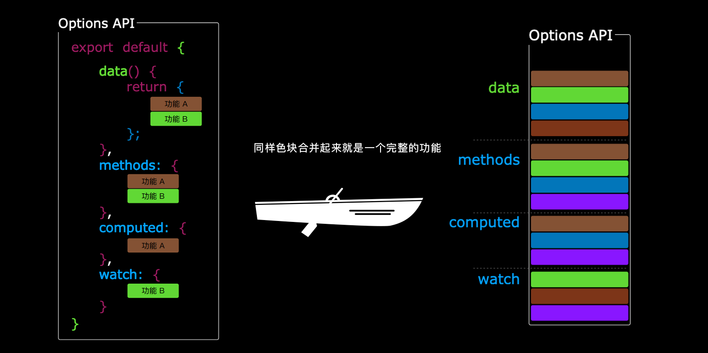

# Vue3.0 遗留万年代码也能重构的Composition API

Hello，大家好，我是李白~~

昨晚写这篇文章的时候，隔壁在聚餐，几位女生欢聚一堂，整个楼层充满了欢声笑语的味道，就好像早上刷牙刷一半就跑去吃了个鸡蛋。

隐隐约约传来了菜刀与菜板的碰撞声，这刀切的技术似乎略输我一筹。

可就算再怎么样，她们也是一群人吃饭啊。而我只能吃两桶泡面，且还能吃出优越感来~~

可叹可叹，心里还是挺羡慕的，羡慕有一起说说笑笑、一起吃饭的人。

也有点心酸，心酸自己，啥也不是，啥也没有，代码写得再6又有何用、有何用、有何用！！！

但我相信，厨艺肯定没有我好！！！！！！！写代码也没我厉害！！！！身高也是我最高！！！（对着电脑，含泪写的文章。）

==分界线==

还请阁下高抬贵手，点个赞~~ 还请大佬口下留情，勿喷我~~


## 什么是 Composition API

以往写代码的时候，每一个功能会有n个变量和n个方法，一团乱麻，导致维护起来上吐下泻的。

`Composition API` 的出现就是为了解决这个问题，每一个功能都能封装成一个函数，一个单独、可复用的函数。

**小的马上闭嘴，赶紧给各位大佬们献上代码、上图~~**

开始王炸，简洁明了的对比图献上~~（来源[@蜗牛老湿_大圣](https://juejin.im/user/1556564194370270)，加我**李白**--PS二次优化的图）




看不懂？？没关系

我们再来看一下代码，以示区别，先实现一个经典的“计时器功能”：

```html
<template>
	<div>{{count}}: {{double}}</div>
	<button @click="increment">+1</button>
</template>
```

```js
// Vue2 写法
export default {
    data(){
        return {
            count: 0
        }
    },
    methods: {
        increment() {
            this.count++;
        }
    },
    computed: {
        double () {
            return this.count * 2;
        }
    }
}
```

上面这种写法，想必大家再熟悉不过了，在组件中实现一个功能，最少得包含这么多的代码块。

这种碎片化使得难以理解和维护复杂的组件。如果需要查找某个功能的逻辑，就需要在这个组件里面，不断滚动查看代码，看完这个逻辑，忘记前面那个逻辑，来来回回就差砸电脑了。

```js
// Vue3 Composition API
import { ref, computed } from 'vue'
export default {
    setup() {
        let count = ref(0)
        let double = computed(() => count.value * 2)
        function increment() {
            count.value++
        }
        return {
            count,
            double,
            increment
        }
    }
}
```

这样是不是简单多了，没有像`vue2`那么多函数块的规矩，直接就是一把梭哈。不过还有更简洁的，有请往下看~~

**代码+图片**，这要是再看不懂，就别怪我口下不留人了。（我转行了，你们自个玩去吧~）


## 代码封装、复用

`Composition API` 最主要的、最有用的，就是可以把代码提取出来，把整个功能封装成一个单独的函数（模块），随处可用。

只需在组件中导入模块，并调用它即可（模块返回的是函数），函数将返回我们定义的变量，随后我们可以从 `setup` 函数中使用它们。

```js
// useCount.js
import { ref, computed } from 'vue'
function useCount() {
    let count = ref(0)
    let double = computed(() => count.value * 2)
    function increment() {
        count.value++
    }
    return {
        count,
        double,
        increment
    }
}
export default useCount

// app.vue
import useCount from './useCount.js'
export default {
	setup() {
		let { count, double, increment } = useCount()
		return { 
			count,
			double,
			increment
		}
	}
}
```


区别有了，下面再来逐步分析其细节

## setup

`setup` 接受两个参数：`props`、`context`

### Props

`setup` 函数中的第一个参数是 `props` 参数。正如你在标准组件中所期望的那样，`setup` 函数中的 `props` 是响应式的，当传入新的 `prop` 时，它将被更新。

```js
export default {
    props: {
        user: {
            type: String,
            defalut: 'Libai'
        }
    },
    setup(props) {
        console.log(props.user)
    }
}
```

### Context

其内部使用**生命周期钩子**需要在前面加上**on**：

钩子函数	  | stup使用
------------- | -------------
beforeCreate  |	Not needed*
created	| Not needed*
beforeMount	| onBeforeMount
mounted |	onMounted
beforeUpdate  |	onBeforeUpdate
updated |	onUpdated
beforeUnmount  |	onBeforeUnmount
unmounted  |	onUnmounted
errorCaptured	| onErrorCaptured
renderTracked |	onRenderTracked
renderTriggered |	onRenderTriggered


默认vue2写法


易维护，可随意拆分成单独的JS文件


任何功能和方法都可以独立存在，可复用


用于解决规模问题的全新 API


在 Vue 3.0 中，基于对象的 2.x API 基本没有变化，并引入了 Composition API[12] — 一套全新的 API，旨在解决 Vue 在大规模应用场景中的痛点。Composition API 构建于响应式 API 之上，实现了类似于 React hook 的逻辑组成与复用，相较于 2.x 基于对象的 API 方式来说，拥有更加灵活的代码组织模式，以及更为可靠的类型推断能力。

Composition API 同时还提供了适用于 Vue 2.x 的版本，可通过 `@vue/composition-api`[13] 插件来在项目中使用，目前已有适用于 Vue 2 和 Vue 3 的 Composition API 实用的工具库（如 `vueuse`[14]，`vue-composable`[15]）。


## 缺点


## TodoList

```js


```